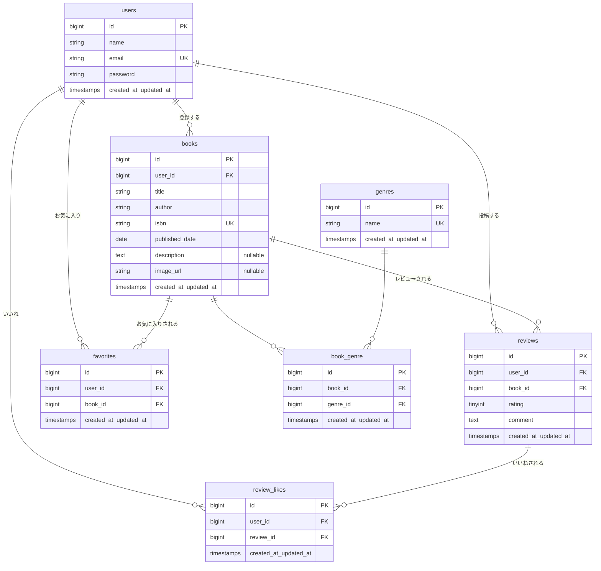

# BookShelf 書籍レビューアプリ

## 概要

BookShelf は、書籍を登録・共有し、レビューやお気に入りを通じて本の魅力を発見できる書籍レビューアプリです。ユーザーは書籍の登録・編集・削除、レビューの投稿・いいね、お気に入り登録ができ、ジャンルごとの分類やレビュー平均評価によるランキング表示に対応しています。また、書籍情報を外部から取得するための公開 API を備えています。

### 主な機能

- 会員登録・ログイン・ログアウト（Laravel Fortify による認証）
- 書籍の一覧・詳細・登録・編集・削除（CRUD）
- レビューの投稿・編集・削除・いいね
- 書籍のお気に入り登録・解除
- ジャンルの管理（CRUD）と、ジャンル別の書籍表示
- レビュー平均評価によるランキング表示
- 公開 API（書籍の一覧・詳細・登録・更新・削除）

## ER図



## 使用技術

- PHP 8.x
- Laravel 10
- MySQL 8.0
- Laravel Sail（Docker）
- Laravel Fortify（認証）
- Vite / Blade（フロントエンド）
- PHPUnit（テスト）
- Laravel Pint（コードフォーマット）

## 環境構築手順

> Blade（`resources/` 配下）の入れ替え手順は、`coachtech-prepared-blade-list/Prepared-blade-mockcase-BookShelf` リポジトリの README を参照してください。

1. リポジトリをクローンする

```bash
git clone git@github.com:momo888-y/bookshelf-app.git
cd bookshelf-app
```

2. 環境変数ファイルを用意する

```bash
cp .env.example .env
```

3. Composer の依存関係をインストールする

```bash
docker run --rm \
    -u "$(id -u):$(id -g)" \
    -v "$(pwd):/var/www/html" \
    -w /var/www/html \
    laravelsail/php83-composer:latest \
    composer install --ignore-platform-reqs
```

4. Sail を起動する

```bash
./vendor/bin/sail up -d
```

5. アプリケーションキーを生成する

```bash
./vendor/bin/sail artisan key:generate
```

6. マイグレーションとシーディングを実行する

```bash
./vendor/bin/sail artisan migrate --seed
```

7. フロントエンドの依存をインストールし、ビルドする

```bash
./vendor/bin/sail npm install
./vendor/bin/sail npm run dev
```

## 開発環境URL

- アプリケーション: http://localhost
- phpMyAdmin: http://localhost:8080

## APIエンドポイント一覧

すべて認証不要の公開 API です。ベースパスは `/api/v1` です。

| メソッド | パス | 概要 |
| --- | --- | --- |
| GET | `/api/v1/books` | 書籍一覧を取得（検索・絞り込み・ページネーション対応） |
| GET | `/api/v1/books/{id}` | 書籍詳細を取得 |
| POST | `/api/v1/books` | 書籍を登録 |
| PUT | `/api/v1/books/{id}` | 書籍を更新 |
| DELETE | `/api/v1/books/{id}` | 書籍を削除 |

### 一覧取得のクエリパラメータ

| パラメータ | 説明 |
| --- | --- |
| `keyword` | タイトル・著者の部分一致検索 |
| `genre_id` | ジャンルによる絞り込み |
| `per_page` | 1ページあたりの件数（デフォルト 20、最大 100） |
| `page` | ページ番号 |

## テスト

```bash
./vendor/bin/sail artisan test
```

カバレッジ付きで実行する場合:

```bash
./vendor/bin/sail artisan test --coverage
```

## 作成者

ももか